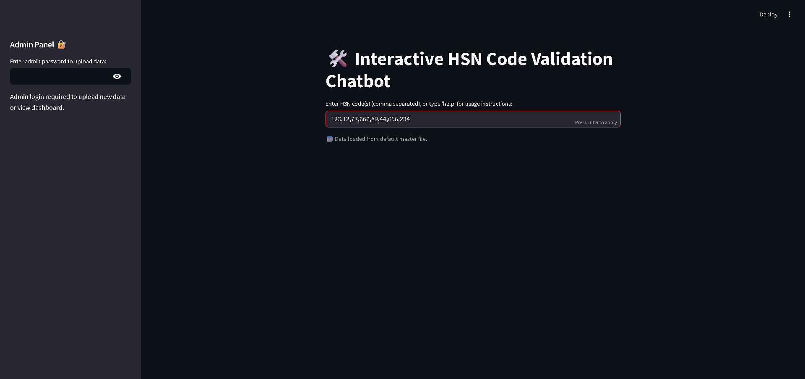
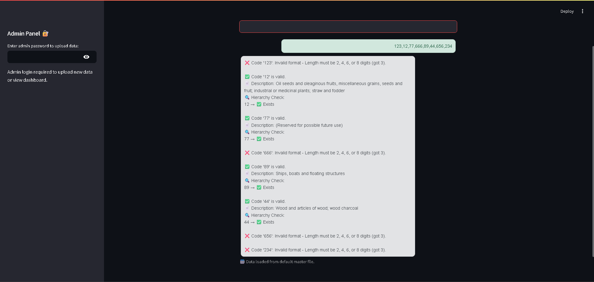

# 🤖 HSN Code Validation Chatbot

This is a simple and interactive Streamlit chatbot that validates one or more HSN (Harmonized System of Nomenclature) codes entered by the user. It checks whether the code is of valid format, exists in the dataset, and validates its hierarchy levels (2, 4, 6, 8 digits).

---

## 💡 Features

- ✅ Real-time HSN code validation  
- 📂 Supports multiple codes (comma separated)  
- 📚 Provides HSN description  
- 🔍 Hierarchy level check for codes  
- 💬 Conversational chat interface using Streamlit  
- 🧠 Modular and clean codebase for future updates  

---

## 🚀 How It Works

1. **User Input**: The user types in one or more HSN codes (comma separated).  
2. **Validation Agent**: The backend logic checks:  
   - Code format (must be 2/4/6/8 digits)  
   - Whether code exists in the dataset  
   - Hierarchical existence of 2-, 4-, 6-, and 8-digit codes  
3. **Response**: Returns description, validity, and hierarchy result in a styled chat format.  

---

## 🖥️ Tech Stack

- Python 🐍  
- Streamlit 🎈  
- Pandas 📊  
- HTML & CSS (in Streamlit Markdown)  

---

## 📸 Screenshots

### 🧾 User Input


### 📬 Bot Response


---
## 📌 Requirements

Before running the app, make sure to install dependencies:

```bash
pip install -r requirements.txt
````

Or manually install:

```bash
pip install streamlit pandas openpyxl
```

---

## ▶️ Run the App

```bash
streamlit run app.py
```

---

## 🛠️ Future Enhancements

* Support SAC codes (Service Accounting Codes)
* Upload new Excel sheet dynamically from UI
* Admin access to edit master data
* Save chat history for analysis
* LLM integration for smarter replies

---

## 📬 Contributing

Pull requests are welcome! For major changes, please open an issue first to discuss what you'd like to change.

---

## © License

This project is for educational/demo purposes only.

---

## 👨‍💻 Author

**Shravan S**
📧 Email: [shravan0601200@gmail.com](mailto:shravan0601200@gmail.com)

```
