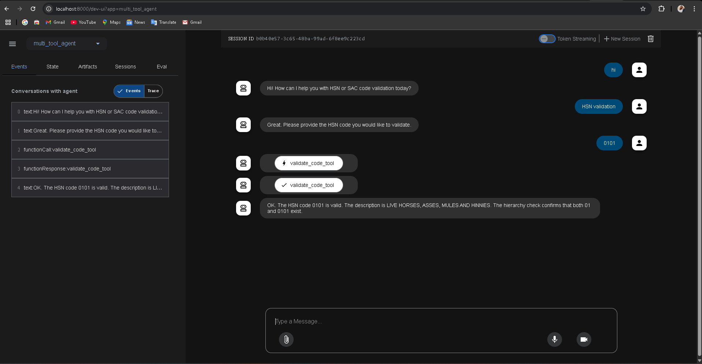

# HSN/SAC Code Validator Agent for Google ADK

## Overview

This agent for the Google Assistant Development Kit (ADK) validates Harmonized System of Nomenclature (HSN) and Services Accounting Code (SAC) codes. Users input codes and receive information about their validity, description, and hierarchical existence.

## Key Features

* **Code Validation:** Checks if an entered code is numeric and has a valid length (2, 4, 6, or 8 digits).
* **Master Data Lookup:** Verifies if the code exists in the provided HSN/SAC master data (from an Excel file).
* **Description Retrieval:** Provides the description for a valid HSN or SAC code.
* **Hierarchy Check:** Shows if prefixes of the code (2, 4, 6/8 digits) exist in the master data.
* **Similar Code Suggestions:** Suggests similar codes if the input is not found.
* **Help Instructions:** Offers guidance on how to use the agent.

## Setup and Installation

1.  **Prerequisites:**
    * Google ADK environment set up.
    * Python 3.x installed.

2.  **Virtual Environment (Recommended):**
    * Create: `python -m venv venv`
    * Activate:
        * macOS/Linux: `source venv/bin/activate`
        * Windows: `.\venv\Scripts\activate`

3.  **Install Dependencies:**
    ```bash
    pip install google-adk pandas difflib
    ```

4.  **File Structure:**
    ```
    your_agent_directory/
    ├── venv/
    ├── agent.py
    └── HSN_SAC.xlsx
    └── README.md
    └── screenshots/
        ├── input_valid_code.png
        └── output_valid_code.png
    ```

5.  **Master Data (`HSN_SAC.xlsx`):**
    * Sheet 1 (index 0): `HSNCode` (HSN codes), `Description`.
    * Sheet 2 (index 1): `SAC_CD` (SAC codes), `SAC_Description`.
    * Codes are case-insensitive, and whitespace is trimmed.

6.  **ADK Configuration:**
    * Point your ADK agent to `agent.py`.
    * Ensure file access for `HSN_SAC.xlsx`.

## Usage Example (with Screenshots)

**Input:** `0101`


**Output:**


## Code Structure

* `load_hsn_data()`: Loads data from `HSN_SAC.xlsx`.
* `HSNValidator` Class:
    * `__init__()`: Initializes data structures.
    * `validate_code_format()`: Checks code format.
    * `code_exists()`: Checks if code exists.
    * `get_code_description()`: Gets code description.
    * `check_hierarchy()`: Checks hierarchical prefixes.
    * `suggest_similar_codes()`: Suggests similar codes.
    * `process_input()`: Handles user input.
* `validate_code_tool()`: ADK tool function for validation.
* `root_agent`: ADK agent definition.
